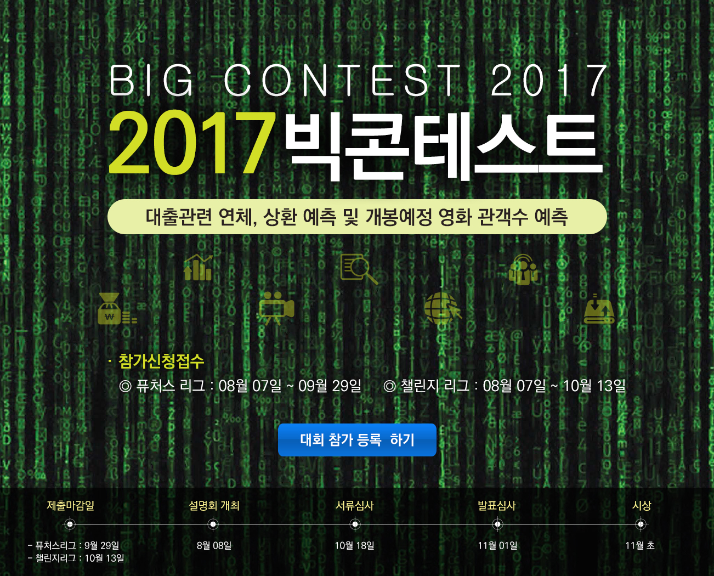

## 2017 빅콘데스트 챌린지리그 : 대출 연체,상환 예측하기
#### 보험, 통신, 신용평가사 (개인정보 비식별)결합데이터를 활용한 대출상환 예측 알고리즘 개발

- Data.
  - 한화생명 : 직업 / 소득 / 배우자직업 / 신용등급 / 한화생명 신용대출정보 / 보험 정보 등 36개 
  - SKT : 통화시간 / 멤버쉽 등급 / 가입년월 / 정지 일수 / 연체금액 등 15개 
  - SCI : 대출 건수 / 대출 총 금액 / 대출계좌 유지 기간 / 보증 건수 / 보증 금액 등 14개 
전체변수 총 69 개 , 관측치 102,252개
TARGET의 반응비율(연체한 비율)이 4%대로 매우 낮음

- 평가지표 : 예측값의 F1 score

- 프로젝트 기간 : 2017.08 ~ 2017.10
- 팀구성 : 1인 
- 기술 및 인프라 : Rstudio ( SVM, Randomforest )

